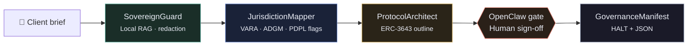

<div align="center">

# ◆ Oasis Tower RWA Pipeline

**RAG-driven fractional real estate tokenization, research POC**

A four-stage agent pipeline that turns a client offering brief into a cited compliance map, permissioned-token architecture outline, and governance manifest with a human sign-off gate before anything ships.

<br />

[](agent/requirements.txt)
[](agent/run_demo.cmd)
[](agent/rag_store.py)
[](openclaw/openclaw.example.json)

<br />

[Live demo](#-live-demo) · [Run CLI](#-quick-start) · [Pipeline](#-pipeline) · [Report (PDF)](#-documentation) · [Architecture](docs/architecture.md)

</div>

---

## Overview

This project models how a regulated **RWA tokenization** intake might work in practice:

| | |
|---|---|
| **Input** | Fictional client brief + offering memorandum corpus |
| **Output** | JSON governance manifest with source citations |
| **Default mode** | Fully offline, no API keys, no GPU |
| **Optional live path** | Kimi-compatible model for stages 2-3 |

> All client names, asset figures, and corpus text are **fictional**. Compliance output is **review-required analysis**, not legal advice. No production Solidity is generated.

---

## Pipeline



<table>
  <tr>
    <th align="left">Stage</th>
    <th align="left">Tier</th>
    <th align="left">What it does</th>
  </tr>
  <tr>
    <td><strong>SovereignGuard</strong></td>
    <td>Local</td>
    <td>RAG over offering memo · PII redaction · escalate facts not in corpus</td>
  </tr>
  <tr>
    <td><strong>JurisdictionMapper</strong></td>
    <td>Agentic (optional)</td>
    <td>Maps asset facts → VARA / ADGM / PDPL review flags with citations</td>
  </tr>
  <tr>
    <td><strong>ProtocolArchitect</strong></td>
    <td>Agentic (optional)</td>
    <td>Drafts ERC-3643-style permissioned token modules (outline only)</td>
  </tr>
  <tr>
    <td><strong>GovernanceManifest</strong></td>
    <td>Deterministic</td>
    <td>Compiles manifest · status <code>HALTED</code> until human approval</td>
  </tr>
</table>

---

## Quick start

### 1 · CLI pipeline (recommended first run)

**Windows**

```cmd
cd agent
run_demo.cmd
```

**macOS / Linux / Git Bash**

```bash
cd agent
python orchestrator.py --brief sample_briefs/oasis_tower_rwa.json --yes
```

Sample output is written to:

```text
agent/sample_outputs/oasis_tower_rwa.output.json
```

<details>
<summary><strong>Windows: if <code>python</code> is not on PATH</strong></summary>

```cmd
cd agent
py -3 orchestrator.py --brief sample_briefs/oasis_tower_rwa.json --yes
```

</details>

---

### 2 · Live demo (browser)

From the project root:

```cmd
serve_web.cmd
```

Then open **[http://localhost:8123](http://localhost:8123)**

| Action | Result |
|--------|--------|
| Click **Run RWA pipeline** | Walks all four stages + governance gate |
| Switch to **Custom RWA brief** | Parses your pasted text (tranche %, escrow, lock period) |
| **Download governance manifest** | Exports full JSON from the demo |

The browser engine mirrors the Python mock pipeline and works with no backend and no API key.

---

### 3 · Live Kimi path (optional)

Requires a Moonshot / Kimi-compatible API key.

```bash
cd agent
pip install -r requirements.txt
cp .env.example .env          # add KIMI_API_KEY
python orchestrator.py --brief sample_briefs/oasis_tower_rwa.json --live --redact --yes
```

Or on Windows:

```cmd
cd agent
run_live.cmd
```

---

## Repository layout

```text
ElChai_Assignment/
├── README.md
├── Detailed Report_ Oasis Tower RWA Pipeline.pdf
├── serve_web.cmd / serve_web.ps1
│
├── agent/                          ← Python pipeline
│   ├── orchestrator.py             ← main entry point
│   ├── rwa_mock.py                 ← offline stage logic
│   ├── rag_store.py                ← keyword RAG retrieval
│   ├── brief_parser.py             ← custom brief field extraction
│   ├── local_qwen.py               ← regex redaction (+ optional Ollama)
│   ├── kimi_client.py              ← live Kimi path
│   ├── prompts/                    ← stage system prompts
│   ├── rag_corpus/                 ← offering memo + compliance chunks
│   ├── sample_briefs/
│   └── sample_outputs/
│
├── web/                            ← landing page + in-browser demo
│   ├── index.html
│   ├── engine.js                   ← browser port of rwa_mock
│   └── vercel.json
│
├── openclaw/                       ← gateway config + skill (deployment path)
├── docs/                           ← architecture & risk notes
└── server/                         ← optional FastAPI wrapper
```

---

## Documentation

| Document | Description |
|----------|-------------|
| [**Detailed Report (PDF)**](Detailed%20Report_%20Oasis%20Tower%20RWA%20Pipeline.pdf) | Full written assessment with model matrix, risks, and recommendation |
| [Architecture](docs/architecture.md) | Pipeline tiers, RAG layer, orchestration |
| [Risks & recommendation](docs/risks-and-recommendation.md) | Limitations and suggested deployment pattern |
| [OpenClaw setup](openclaw/README.md) | Gateway config for Slack / Teams / WebChat routing |

---

## Tech stack

| Layer | Tools |
|-------|-------|
| Pipeline | Python 3.11+, JSON briefs, deterministic mock + optional Kimi API |
| RAG | Committed JSON corpus, keyword overlap retrieval (no vector DB) |
| Local tier | Regex redaction; Qwen via Ollama optional |
| Frontend | Vanilla HTML / CSS / JS, bilingual EN / AR |
| Deploy | Static `web/` (Vercel-ready) · optional FastAPI backend |

---

## Custom brief smoke test

Paste this under **Custom RWA brief** on the landing page:

```text
We represent Harbor Point REIT (fictional) and want to tokenize a first tranche
of 22% of economic interest in Harbor Point Tower, a Grade-A office building in
Abu Dhabi Global Market. Professional investors only. KYC before whitelisting.
Quarterly distributions with 8% maintenance reserve. 18-month transfer restriction.
Escrow until AED 32M minimum. ERC-3643-style permissioned tokens preferred.
```

Expected: facts cite `client-brief`, tranche **22%**, reserve **8%**, lock **18-month**, escrow **AED 32M**.

---

## Disclaimer

This repository is a **research and demonstration POC** only.

- Fictional client data throughout  
- Not legal, financial, or regulatory advice  
- Not affiliated with or endorsed by Elchai Group  
- Do not use on real client data without legal and IT review  

---

<div align="center">

**Youssief Khalifa** · Al Ain, UAE

<br />

◆ *Oasis Tower RWA Pipeline*

</div>
